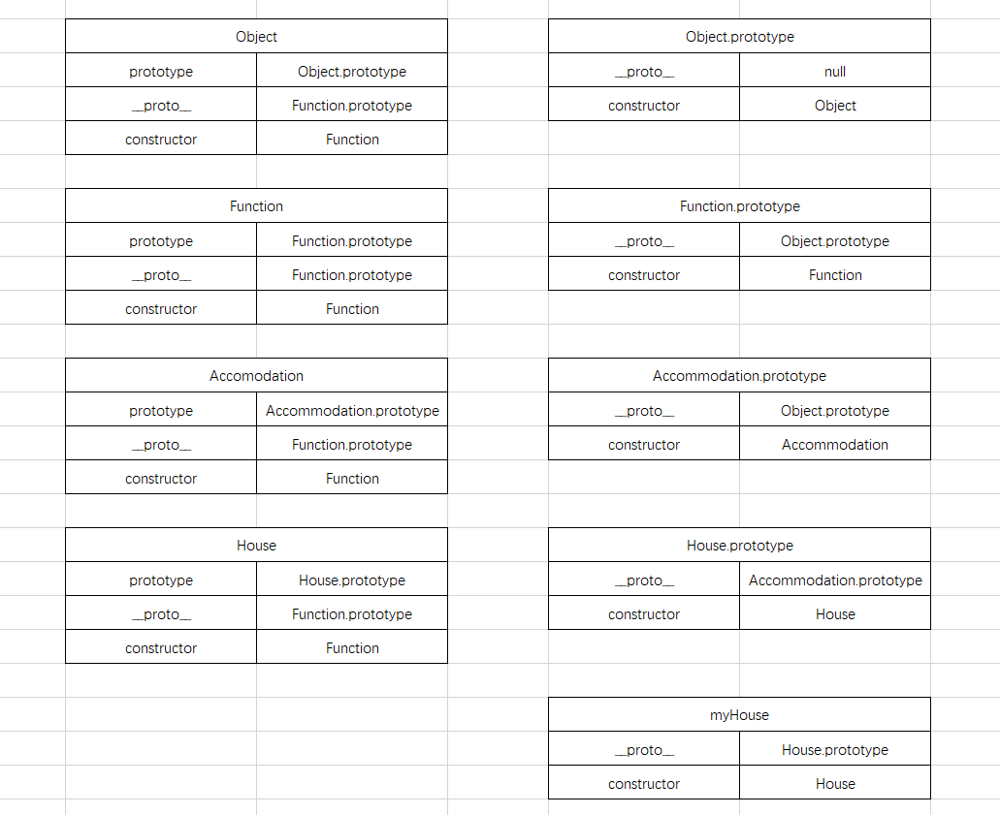

# 20190114-深入理解原型

1. Object & Function 的关系
    * Object 和 Function 就是鸡和鸡蛋的关系
        ```js
            Function instanceof Object //true
            Object instanceof Function //true
        ```
    * 引擎先创建Object.prototype, 再创建Function.prototype, 并且Function.prototype.__proto__指向Object.prototype
        ```js
            Object.__proto__ === Function.prototype //true
            Object.constructor === Function //true
            Object.prototype.__proto__ === null //true
            Object.prototype.constructor === Object //true
            Function.__proto__ === Function.prototype //true
            Function.constructor === Function //true
            Function.prototype.__proto__ === Object.prototype //true
            Function.prototype.constructor === Function //true
        ```
2. 每个函数都有prototype, 函数包含普通函数和构造函数, 函数也可以算是一种对象, 也有__proto__和constructor
    ```js
        function testFunction(){}
        testFunction.__proto__ === Function.prototype //true
        testFunction.construcor === Function //true
    ```
3. 每个对象都有__proto__和constructor
4. 
   1. 函数对象的__proto__都指向Function.prototype，constructor都指向Function
   2. 普通对象的__proto__都指向Object.prototype除了Object.prototype.__proto__指向null以及继承的子类的prototype的__proto__指向父类的prototype，普通对象的constructor指向创建这个对象实例的基类，如果是类的原型对象的constructor指向该类
        ```js
            function Accommodation(){}
            function House(){}
            // 先继承，后创建House的实例
            House.prototype = new Accommodation();  // 继承后House.prototype.constuctor 指向创建这个实例的类，即Accommodation
            House.prototype.constructor = House; // 回指constructor为House
            var myHouse = new House();
            myHouse.__proto__ === House.prototype // true
            myHouse.constructor === House // true
            myHouse instanceof House // true    这里的instanceof 其实就是找myHouse.__proto__ === House.prototype
            myHouse instanceof Accommodation // true    这里的instanceof 其实就是找myHouse.__proto__.__proto__ === Accommodation.prototype
            myHouse instanceof Object // true    这里的instanceof 其实就是找myHouse.__proto__.__proto__.__proto__ === Object.prototype
        ```
    3. 以上demo是正常继承后再创建myHouse这个实例，以下分析先创建实例再继承会出现的问题以及解决方法
        ```js
            function Accommodation(){}
            function House(){}
            // 先创建myHouse，再继承
            var myHouse = new House();  // 创建myHouse实例后，myHouse.__proto__和House.prototype指向同一物理地址，假如为0xA
            myHouse.__proto__ === House.prototype // true
            myHouse.__proto__.__proto__ === Object.prototype // true
            myHouse.constructor === House // true
            House.prototype = new Accommodation();  // 继承后，House.prototype指向新的物理地址，假如为0xB
            House.prototype.constructor = House;
            myHouse.__proto__ === House.prototype   // false 这时两个指向的地址已经不一样了，所以为false 或者直接把myHouse = new House();重新指向另一个地址
            myHouse.__proto__ === Accommodation.prototype   // false
            myHouse.__proto__.__proto__ === Accommodation.prototype   // false
            myHouse.__proto__.__proto__ === Object.prototype   // true  原来的地址的__proto__就是指向Object.prototype
            // 恢复原型链
            myHouse.__proto__ = House.prototype;    // 重新指向同一个地址，即myHouse.__proto__ 指向0xB
            myHouse.__proto__ === House.prototype   // true 这时两个指向的地址已经一样了，0xB，所以为false
            myHouse.__proto__ === Accommodation.prototype   // false
            myHouse.__proto__.__proto__ === Accommodation.prototype   // true
            myHouse.__proto__.__proto__ === Object.prototype   // false  Accommodation.prototype
        ```